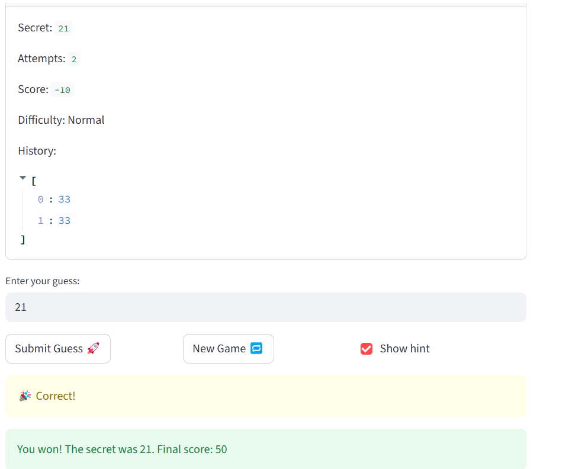

# 🎮 Game Glitch Investigator: The Impossible Guesser

## 🚨 The Situation

You asked an AI to build a simple "Number Guessing Game" using Streamlit.
It wrote the code, ran away, and now the game is unplayable. 

- You can't win.
- The hints lie to you.
- The secret number seems to have commitment issues.

## 🛠️ Setup

1. Install dependencies: `pip install -r requirements.txt`
2. Run the broken app: `python -m streamlit run app.py`

## 🕵️‍♂️ Your Mission

1. **Play the game.** Open the "Developer Debug Info" tab in the app to see the secret number. Try to win.
2. **Find the State Bug.** Why does the secret number change every time you click "Submit"? Ask ChatGPT: *"How do I keep a variable from resetting in Streamlit when I click a button?"*
3. **Fix the Logic.** The hints ("Higher/Lower") are wrong. Fix them.
4. **Refactor & Test.** - Move the logic into `logic_utils.py`.
   - Run `pytest` in your terminal.
   - Keep fixing until all tests pass!

## 📝 Document Your Experience

- [ ] Describe the game's purpose.
 The Game is meant to be a guessing game with three ranges of difficulty, Easy Normal and Hard. Increase in difficulty means increased in the number pool you have to guess with less attempts. If you guess in the allotted number of attempts you win, if not you have to keep guessing. If the atempts run out, you lose.
- [ ] Detail which bugs you found.
1.The Submit Guess originally signalled to GO Lower even on the right guess. After that was fixed, the Secret Number Changed regardless if whether the guess was right or not.
2. The guess was originally a string
3.Normal difficulty had a higher range of difficulty than hard and less attempts
4. Update_score logic was flawed
- [ ] Explain what fixes you applied.
I changed the type of guess from string to int. I fixed the logic of submit guess . I also fixed the difficulty ranges and the nuber off attempts.

## 📸 Demo

- [ ] [Insert a screenshot of your fixed, winning game here]

## 🚀 Stretch Features

- [ ] [If you choose to complete Challenge 4, insert a screenshot of your Enhanced Game UI here]
